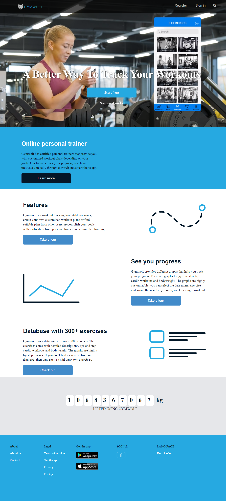
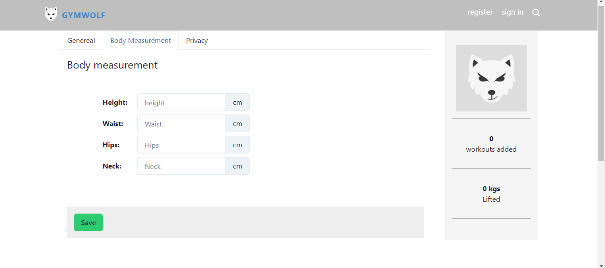
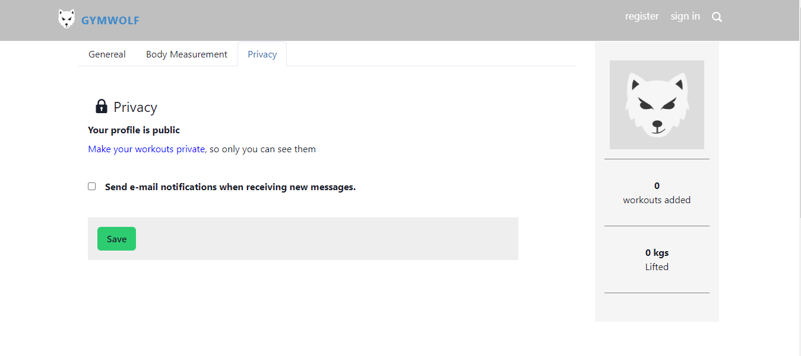
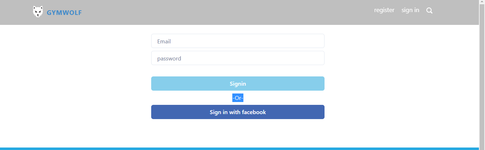
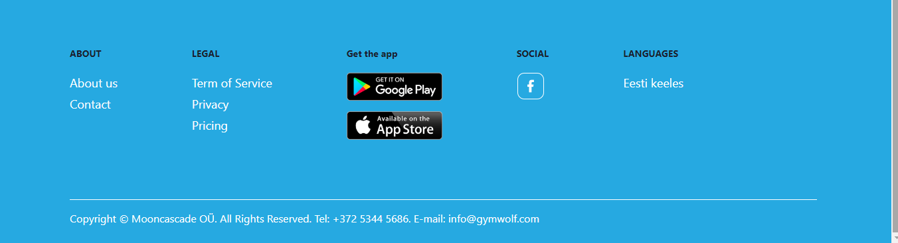

# peaceful-egg-789
Gymwolf- is the best tool to track your workouts online

# GymWolf Clone

This Individual project is a clone of the [GYMWOLF](https://www.gymwolf.com/) website.As a Individual cloned this website during our Unit 3 construct project week in Masai School, Bangalore.

"GYMWOLF goal is to make people happy and fit, to offer them the simplest way to track workouts and to communicate with personal trainer."

## Deployed Site

[Gymwolf clone](https://gymwolf-shridhar1998.vercel.app/)

## Features

- Register / Login page with user's authentication
- Landing pages for information of website.

## Tech Stack

- HTML | CSS | JavaScript | React 

### Libraries Used

- Chakra UI

## Contributors
- [@SHRIDHAR R HAKKE](https://github.com/Shridhar1998)

## Website Sneak Peeks

### Sneak Peeks on Large Devices

- **Landing Page**

  
  
- **Register**

**General**

  

**Body Measurement**

  

**Privacy**
  

  - **Login**

    

- **Footer**

  
